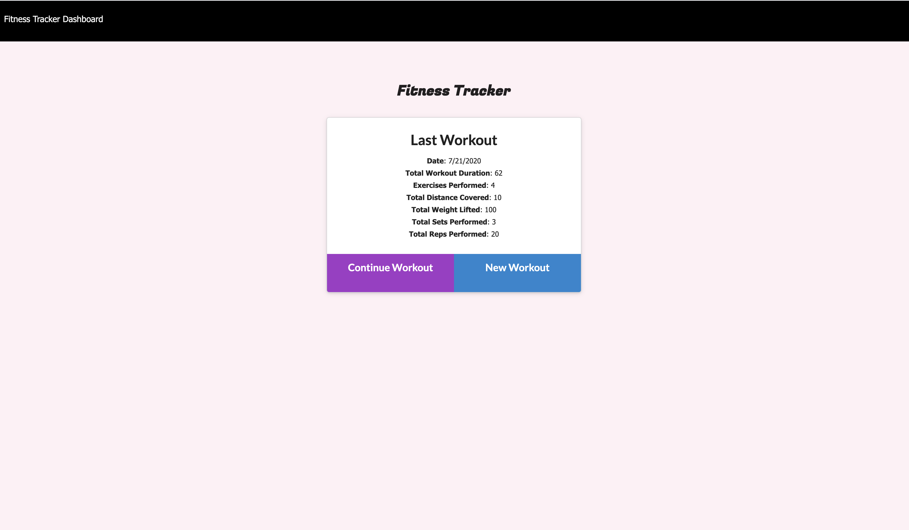
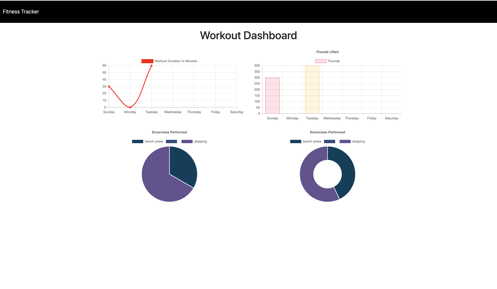

# FitnessTracker

The purpose of this app is to help create work out plans and add exercises to it. It also shows the statistics of the user's weekly progress in terms of graphs and charts. The app is designed using MVC Pattern

# Screenshots

